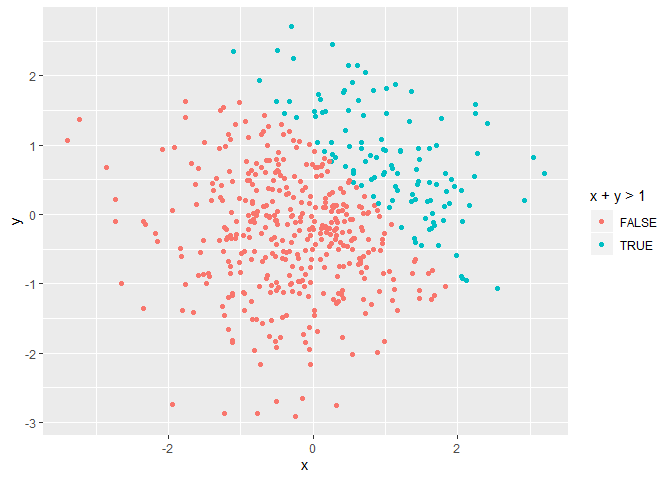
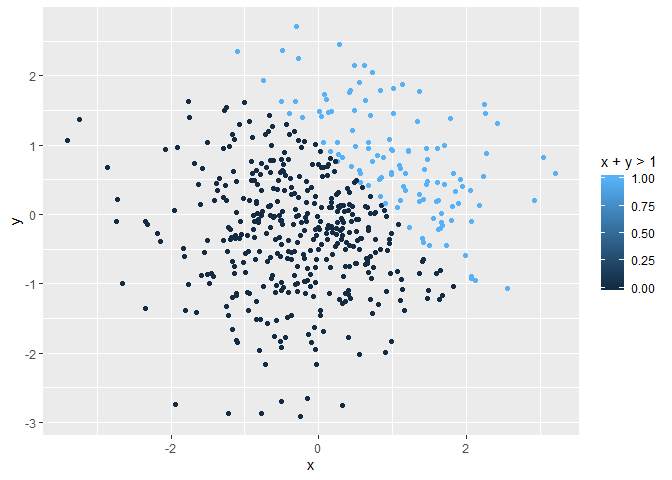

p8105\_hw1\_xw2417
================
Xun Wang
9/20/2019

This is the solution for P8105 homework 1 from Xun Wang.

## Problem 1

The code chunk below **creates a dataframe** compromised of a random
sample of size 8 from a standard Normal distribution, a logical vector
indicating whether elements of the sample are greater than 0, a
character vector of length 8, a factor vector of length 8 with 3
different factor “levels”.

``` r
set.seed(1234)

prob1_df = tibble(
  vec_numeric = rnorm(8),
  vec_logical = vec_numeric > 0,
  vec_char = c("This","is", "the", "first", "data", "frame", "from", "Xun")，
  vec_factor = factor(c("he", "he", "he", "she", "she", "she", "they", "they"))
)

## The code below tries to take the mean of each variable in my dateframe.

mean_numeric = mean(pull(prob1_df, vec_numeric))
mean_logical = mean(pull(prob1_df, vec_logical))
mean_char = mean(pull(prob1_df, vec_char))
```

    ## Warning in mean.default(pull(prob1_df, vec_char)): argument is not numeric
    ## or logical: returning NA

``` r
mean_factor = mean(pull(prob1_df, vec_factor))
```

    ## Warning in mean.default(pull(prob1_df, vec_factor)): argument is not
    ## numeric or logical: returning NA

**Summary 1:** The **“mean”** works for numeric and logical variables
but not for character or factor variables if the argument is not numeric
or logical.

The code chunk below **converts** the logical vector to numeric or a
factor and **multiplies** the random sample by the result. And it
converts the logical vector to a factor and then converts the result to
numeric, and multiplies the random sample by the
    result.

``` r
as.numeric(pull(prob1_df, vec_logical))*pull(prob1_df, vec_numeric)
```

    ## [1] 0.0000000 0.2774292 1.0844412 0.0000000 0.4291247 0.5060559 0.0000000
    ## [8] 0.0000000

``` r
as.factor(pull(prob1_df, vec_logical))*pull(prob1_df, vec_numeric)
```

    ## Warning in Ops.factor(as.factor(pull(prob1_df, vec_logical)),
    ## pull(prob1_df, : '*' not meaningful for factors

    ## [1] NA NA NA NA NA NA NA NA

``` r
as.numeric(as.factor(pull(prob1_df, vec_logical)))*pull(prob1_df, vec_numeric)
```

    ## [1] -1.2070657  0.5548585  2.1688824 -2.3456977  0.8582494  1.0121118
    ## [7] -0.5747400 -0.5466319

**Summary 2:** Logical variables can be multiplied with numeric
variables, but factors can’t be multiplies.

## Problem 2

The code chunk below creates a data frame comprised of x and y both from
random sampling of size 500 from a standard Normal distribution.

``` r
set.seed(1234)

prob2_df = tibble(
  x = rnorm(500),
  y = rnorm(500),
  vec_logical = x + y > 1,
  vec_numeric = as.numeric(vec_logical),
  vec_factor = as.factor(vec_logical)
)

df_nrow = nrow(prob2_df)
df_ncol = ncol(prob2_df)
x_mean = mean(pull(prob2_df, x))
x_median = median(pull(prob2_df, x))
x_sd = sd(pull(prob2_df, x))
pos_prop = sum(pull(prob2_df, vec_logical)) / length(pull(prob2_df, vec_logical))
```

The vector created above is 500 rows \* 5 columns. The mean of x is
0.0018388. The median of x is -0.0207073. The standard deviationof x is
1.0348139. The proportion of cases for which x + y \> 1 is 0.232.

This code chunk makes scatterplots of y vs x colored by logical
variables created in Problem 2 data
frame.

``` r
ggplot(prob2_df, aes(x = x, y = y, color = vec_logical)) + geom_point() + labs(color = "x + y > 1")
```

<!-- -->

This code chunk makes scatterplots of y vs x colored by numeric
variables created in Problem 2 data frame.

``` r
library(ggplot2)
ggplot(prob2_df, aes(x = x, y = y, color = vec_numeric)) + geom_point() +labs(color = "x + y > 1")
```

<!-- -->

This code chunk makes scatterplots of y vs x colored by factor variables
created in Problem 2 data
frame.

``` r
ggplot(prob2_df, aes(x = x, y = y, color = vec_factor)) + geom_point() + labs(color = "x + y > 1")
```

<!-- -->

**Comments:** We can use all these three three variable types (logical,
numeric and factor) to define colors in scatter plots. For logical
variables, there are only 2 colors assigned for either False or True;
for numeric varibles, the colors are defined by a scale from the lowest
value to the highest value; for factor variables, we need to see if the
values in it are numeric or logical, and then the colors are defined by
the type of the values.

This code chunk exports the scatterplot colored by the logical variable.
